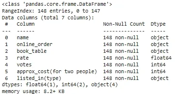

# 🍽️ Zomato Data Analysis Using Python


Understanding customer preferences and restaurant trends is essential for making informed business decisions in the food industry. In this project, we analyze Zomato’s restaurant dataset using Python to uncover meaningful insights.


---


## 📌 Objectives


We aim to answer key questions such as:


- Do more restaurants provide online delivery compared to offline services?
- Which types of restaurants are most favored by the general public?
- What price range do couples prefer for dining out?


---


## 🛠️ Implementation Steps


### Step 1: Import Required Libraries


```
import pandas as pd
import numpy as np
import matplotlib.pyplot as plt
import seaborn as sns
```


---


Step 2: Load the Dataset


> Download the dataset and load it using Pandas.


```
dataframe = pd.read_csv("/content/Zomato-data-.csv")
print(dataframe.head())
```
**OUTPUT:**


---


Step 3: Data Cleaning & Preparation


1. Convert rate column to float

```
def handleRate(value):
    value = str(value).split('/')
    value = value[0]
    return float(value)


dataframe['rate'] = dataframe['rate'].apply(handleRate)
```
**OUTPUT:**


2. View Dataset Summary

```
dataframe.info()
```

**OUTPUT:**



3. Check for Null Values

```
print(dataframe.isnull().sum())
```

**OUTPUT:**


✅ There are no null values in the dataset.


---


Step 4: Exploring Restaurant Types


1. Count of Restaurant Categories

```
sns.countplot(x=dataframe['listed_in(type)'])
plt.xlabel("Type of restaurant")
plt.show()
```

**OUTPUT:**


✅ Most restaurants fall under the "Dining" category.


2. Votes by Restaurant Type

```
grouped_data = dataframe.groupby('listed_in(type)')['votes'].sum()
result = pd.DataFrame({'votes': grouped_data})
plt.plot(result, c='green', marker='o')
plt.xlabel('Type of restaurant')
plt.ylabel('Votes')
plt.show()
```

**OUTPUT:**


✅ Dining restaurants receive the highest number of votes.


---


Step 5: Most Voted Restaurant

```
max_votes = dataframe['votes'].max()
restaurant_with_max_votes = dataframe.loc[dataframe['votes'] == max_votes, 'name']
print('Restaurant(s) with the maximum votes:')
print(restaurant_with_max_votes)
```

**OUTPUT:**


---


Step 6: Online Order Availability

```
sns.countplot(x=dataframe['online_order'])
plt.title('Online vs Offline Order')
plt.show()
```

**OUTPUT:**


✅ Most restaurants do not accept online orders.


---


Step 7: Rating Distribution

```
plt.hist(dataframe['rate'], bins=5)
plt.title('Ratings Distribution')
plt.show()
```

**OUTPUT:**


✅ Majority of ratings fall between 3.5 to 4.


---


Step 8: Preferred Price Range for Couples

```
couple_data = dataframe['approx_cost(for two people)']
sns.countplot(x=couple_data)
plt.title("Approximate Cost for Two")
plt.show()
```

**OUTPUT:**


✅ Most couples prefer a dining cost of approximately 300 rupees.


---


Step 9: Online vs Offline Ratings Comparison

```
plt.figure(figsize=(6,6))
sns.boxplot(x='online_order', y='rate', data=dataframe)
plt.title("Ratings: Online vs Offline Orders")
plt.show()
```

**OUTPUT:**


✅ Restaurants with online orders have better ratings compared to offline ones.


---


Step 10: Order Mode vs Restaurant Type (Heatmap)

```
pivot_table = dataframe.pivot_table(index='listed_in(type)', columns='online_order', aggfunc='size', fill_value=0)
sns.heatmap(pivot_table, annot=True, cmap='YlGnBu', fmt='d')
plt.title('Online Order Preference by Restaurant Type')
plt.xlabel('Online Order')
plt.ylabel('Restaurant Type')
plt.show()
```

**OUTPUT:**


✅ Dining-type restaurants are more likely to accept online orders.


---


📊 Conclusions


Online ordering is less popular than offline services, but restaurants offering online orders tend to have higher ratings.


Dining restaurants are the most favored type and receive the most votes.


₹300 is the most common price point for couples dining out.


---


🧠 Libraries Used


Pandas


NumPy


Matplotlib


Seaborn


---


🗂️ Dataset


> Dataset used in this project: Zomato-data-.csv


Make sure the CSV file is in the same directory as your Python script or adjust the file path accordingly.


---


📌 Author


Johnson Munisi
Data Analysis | Python Enthusiast


---


📜 License


This project is open source and free to use under the MIT License.
